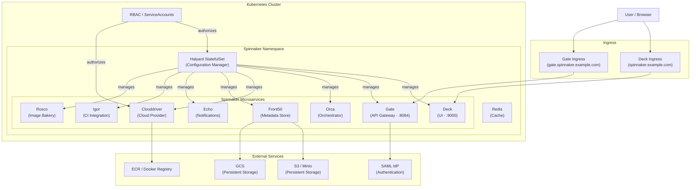

# Spinnaker Helm Chart

Production-ready Helm chart for deploying Spinnaker CD platform on Kubernetes.

## Architecture



## Features

- **Halyard-managed deployment** - Uses Halyard StatefulSet for reliable configuration management
- **Multi-backend storage** - Supports S3, GCS, Minio, and Azure Storage
- **Docker registry integration** - ECR, GCR, Docker Hub, and private registries
- **RBAC and ServiceAccounts** - Fine-grained Kubernetes RBAC with dedicated service accounts
- **Ingress routing** - Configurable Ingress for Deck (UI) and Gate (API) with TLS support
- **SAML authentication** - Built-in SAML SSO configuration via Halyard scripts
- **Extensible configuration** - Additional scripts, secrets, config maps, and profile overrides
- **Feature flags** - Toggle Spinnaker features (artifacts, jobs, pipeline-templates, etc.)

## Prerequisites

- Kubernetes cluster (v1.19+)
- Helm 3.x
- A storage backend (S3, GCS, or Minio for local dev)
- (Optional) Docker registry credentials for private images
- (Optional) SAML IdP metadata for SSO

## Installation

### Quick Start (Local Development with Minio)

```bash
helm install spinnaker ./spinnaker -f examples/values-minimal.yaml \
  --namespace spinnaker --create-namespace \
  --timeout 10m
```

### AWS (S3 + ECR)

```bash
helm install spinnaker ./spinnaker -f examples/values-aws.yaml \
  --namespace spinnaker --create-namespace \
  --set s3.accessKey=YOUR_ACCESS_KEY \
  --set s3.secretKey=YOUR_SECRET_KEY \
  --timeout 10m
```

### GCS

```bash
helm install spinnaker ./spinnaker -f examples/values-gcs.yaml \
  --namespace spinnaker --create-namespace \
  --set gcs.jsonKey="$(cat /path/to/service-account.json)" \
  --timeout 10m
```

### Access the UI

```bash
# Port-forward Deck (UI)
export DECK_POD=$(kubectl get pods -n spinnaker -l "cluster=spin-deck" -o jsonpath="{.items[0].metadata.name}")
kubectl port-forward -n spinnaker $DECK_POD 9000

# Open http://127.0.0.1:9000
```

## Configuration Reference

| Parameter | Description | Default |
|-----------|-------------|---------|
| `halyard.spinnakerVersion` | Spinnaker version to deploy | `1.11.6` |
| `halyard.image.repository` | Halyard container image | `gcr.io/spinnaker-marketplace/halyard` |
| `halyard.image.tag` | Halyard image tag | `1.13.1` |
| `dockerRegistries` | List of Docker registries to configure | `[]` |
| `minio.enabled` | Enable Minio for local S3 storage | `true` |
| `minio.accessKey` | Minio access key | `changeme-minio-access` |
| `minio.secretKey` | Minio secret key | `changeme-minio-password` |
| `s3.enabled` | Enable AWS S3 storage backend | `false` |
| `s3.bucket` | S3 bucket name | `""` |
| `s3.region` | AWS region | `""` |
| `gcs.enabled` | Enable Google Cloud Storage | `false` |
| `gcs.project` | GCP project name | `""` |
| `gcs.bucket` | GCS bucket name | `""` |
| `ingress.enabled` | Enable Ingress for Deck (UI) | `false` |
| `ingress.host` | Hostname for Deck | `""` |
| `ingressGate.enabled` | Enable Ingress for Gate (API) | `false` |
| `ingressGate.host` | Hostname for Gate | `""` |
| `rbac.create` | Create RBAC resources | `true` |
| `serviceAccount.create` | Create ServiceAccounts | `true` |
| `redis.password` | Redis password | `changeme-redis-password` |
| `spinnakerFeatureFlags` | List of Spinnaker features to enable | `[artifacts, jobs]` |
| `kubeConfig.enabled` | Use external kubeconfig for multi-cluster | `false` |
| `halyard.additionalScripts.enabled` | Enable additional Halyard config scripts | `false` |
| `halyard.additionalSecrets.create` | Create additional secrets (e.g., SAML keystores) | `false` |

See [`values.yaml`](values.yaml) for the complete list of configurable parameters.

## Architecture Decisions

- **Halyard as StatefulSet**: Halyard manages Spinnaker's lifecycle and stores configuration in a PersistentVolume, ensuring config survives pod restarts and upgrades.
- **Redis as cache**: An in-cluster Redis instance is deployed as a dependency for Spinnaker's caching layer. It is not exposed externally.
- **Hook-based deployment**: Helm post-install/post-upgrade hooks trigger `hal deploy apply` to roll out Spinnaker microservices after Halyard is ready.
- **Modular storage**: Storage backends are mutually configurable -- enable only one of Minio, S3, GCS, or Azure Storage.
- **SAML via additional scripts**: SAML authentication is configured through Halyard's `additionalScripts` mechanism, keeping auth config separate from core chart logic. See [`values_saml.yaml`](values_saml.yaml) for a complete example.

## Adding Kubernetes Clusters

By default, only the local cluster is registered as a deployment target. To add remote clusters:

1. Upload your kubeconfig as a secret:
   ```bash
   kubectl create secret generic my-kubeconfig --from-file=$HOME/.kube/config -n spinnaker
   ```

2. Configure the chart:
   ```yaml
   kubeConfig:
     enabled: true
     secretName: my-kubeconfig
     secretKey: config
     contexts:
       - my-remote-cluster
     deploymentContext: my-remote-cluster
   ```

## Upgrade Guide

### From Helm 2 to Helm 3

This chart uses Helm 3 (`apiVersion: v2`). If migrating from a Helm 2 installation:

1. Install the [helm-2to3](https://github.com/helm/helm-2to3) plugin
2. Migrate your release: `helm 2to3 convert spinnaker`
3. Upgrade: `helm upgrade spinnaker ./spinnaker -f your-values.yaml`

### Upgrading Spinnaker Version

Update the `halyard.spinnakerVersion` value and run:

```bash
helm upgrade spinnaker ./spinnaker --set halyard.spinnakerVersion=NEW_VERSION --timeout 10m
```

## Contributing

1. Fork the repository
2. Create a feature branch (`git checkout -b feature/my-feature`)
3. Make your changes and test with `helm lint` and `helm template`
4. Submit a pull request

## License

This project is licensed under the MIT License. See [LICENSE](LICENSE) for details.
